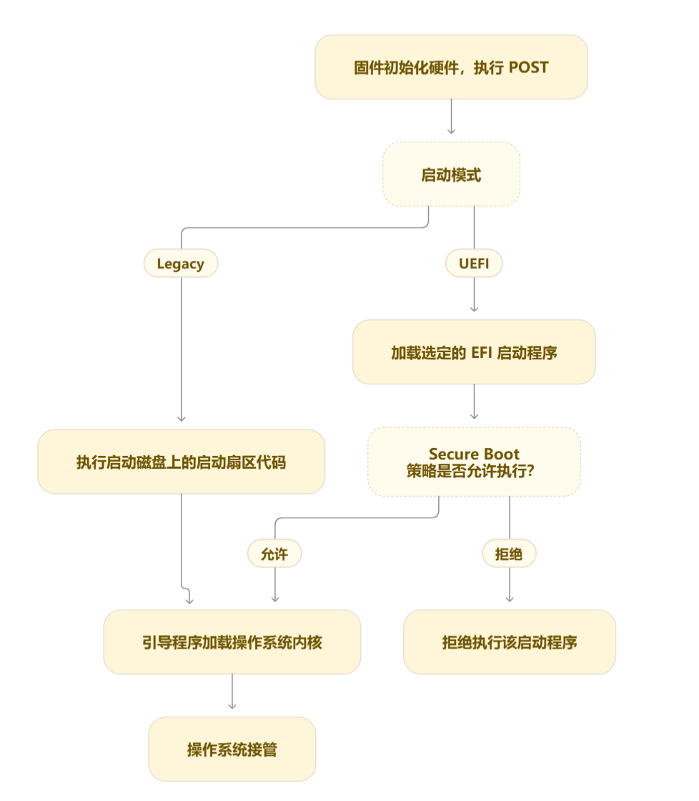
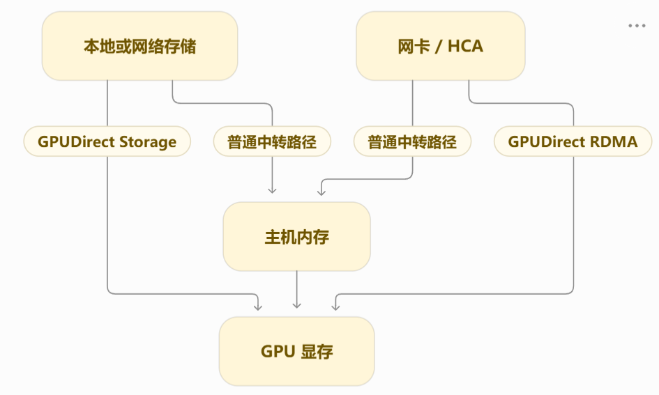
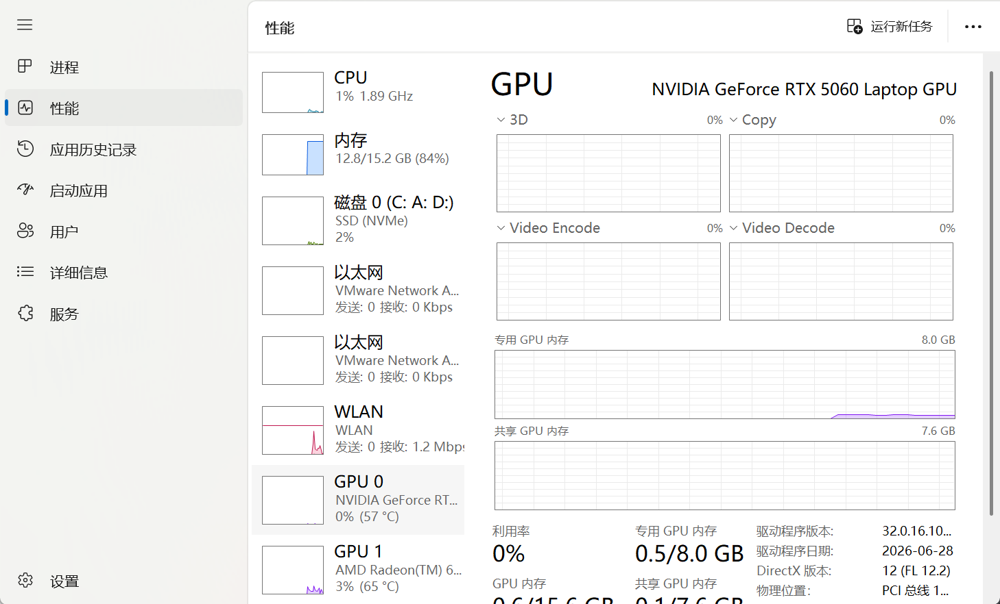
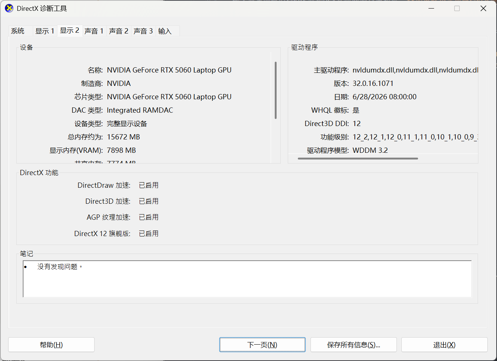

# 硬件相关的学习笔记

## 服务器基础架构
先从最核心的CPU学。主板上有个CPU插座，这个插座就叫**Socket**，装一颗CPU就是单路，装两颗就是双路；所以几路说的是芯片的数量。而**Core**就是芯片里实际执行指令的物理核心，比如我这个CPU是16核32线程，那就是16个Core。  
但是，CPU核心并不是一直有事情做的，就比如那种，需要去内存搬运数据的任务，就是说，必须先搬运数据，才能进行后续的计算。这种情况，CPU就会闲置。所以就有了**SMT**，他让一个核心同时容纳多个硬件线程，这样可以利用这种闲置的资源。  
这样子的话，一颗CPU如果有4个核心，然后开启SMT，每个核心就可以有2个硬件线程了，相当于8个。 硬件线程。
逻辑CPU就是操作系统可以分别调度任务的位置，每个硬件线程对应一个逻辑CPU，但是并不是物理核心。  
至于Cache，之前学习CSAPP深入了解过。Cache就是缓存，是为了提高访问数据的速度的。之所以引入缓存，就是因为，如果每次都去内存拿数据，会很慢，那么有什么办法加快呢？就是引入缓存。比如某一次访问了一个数据，就会把这个数据相邻的数据全部一起搬到缓存来，然后如果后面刚好要访问这些数据的时候，就会缓存命中；由于缓存的访问速度非常快，比内存快不少，所以效率也就提高了。所以要利用好局部性原理来提高缓存命中率。具体一点来说，比如要访问一个矩阵吧，按行访问会比按列访问要快得多，因为按行访问的时候，相邻的元素都会被用上，所以缓存命中率很高；而按列访问的时候访问的内存地址是不连续的，所以很多Cache Miss。L1,L2,L3就是三级缓存。其中L1最快，但是也最小；L3最慢，但是最大。比如我的电脑，L1是1.2MB，L3是64MB。  
内存的容量决定能放多少数据，**内存通道**决定能同时以多大带宽搬数据，所以内存插满了不代表带宽就用满了(我还记得之前研究配电脑的时候，就说过最好不要插满4跟，插1,3槽就行)  
**DIMM**是一整条内存模块，也就是插进主板的内存条。**内存控制器**是负责接收CPU的内存访问请求然后安排读写，所以他就是manager，他一般位于CPU内部。**内存通道**就像运输数据的道路，通道越多，可以同时搬运的数据越多。
**但是注意，插槽的数量不等于通道的数量，因为一个通道可以连接多个内存插槽**，同一通道里多插一条内存，容量确实会增加，但是通道不变。  
**还有就是，有时候我们会觉得CPU核心越多，程序运行的越快，但其实不一定。如果电脑的内存太小(比如我的，只有16GB)，那么内存通道供不上，核心就只能等待数据，意义就不是很大了**。而且我知道的是，对于我这个笔记本来说，双8GB比单根16GB的内存要快，因为是双通道。  
看到**双路服务器**。双路服务器就是两颗CPU各自有自己的内存控制器，也各自连接一组内存条，但是两颗CPU质检有高速互连连接。也就是说，CPU0可以通过CPU间互连来访问CPU1的内存。CPU0访问自己的内存，叫做**本地内存访问**；访问CPU1那边的内存，叫做**远程内存访问。**远程访问延迟会更高，而且会占用CPU间互连的带宽**。访问不同位置的内存，代价不一样，这就是**NUMA，Non-Uniform Memory Access。**  
操作系统会把这些访问距离不同的资源划分成NUMA Node，每颗CPU和它连接的内存组成一个Node。  
而且我们写程序的时候会无意间决定数据放在哪一边。比如用多线程处理一个巨大的数组，主线程在CPU0上初始化整个数组，工作线程分别在CPU0和CPU1上处理数组的不同部分。如果数组的物理页主要分配在Node0，那么CPU1上的线程就会频繁访问远程内存。  
内存会通过**内存通道**连接CPU，而**GPU、网卡和NVMe SSD**通过**PCIe**连接CPU  
这里就引出了PCIe，他是设备之间的高速运输道路。从CPU、内存系统通往PCIe设备的入口叫做**PCIe Root Complex**，现在的这些服务器都把他们集成在CPU里。  
**PCIe x4,x8,x16**代表一条连接使用了多少条**lane**，一条**lane**是一组高速传输通路，具备独立的发送和接收方向，相同的PCIe代际下，lane越多，理论总带宽越大。x16就是16条lane一起传输。  
**CPU提供的PCIe lane数量有限，主板必须把他们分配给显卡，网卡，SSD等设备**  
当设备多的时候，还可能用到**PCIe Switch**，他叫PCIe交换芯片，在CPU和多个设备之间转发数据。比如两张卡可以各自通过x16连接到交换芯片，但是交换芯片只有一条x16上行连接到CPU；两张卡都觉得自己是x16的，但是他们如果同时向主机内存传输的时候，还是会争夺这条连接
此外，x16的插槽不一定工作在x16，因为有可能是一个x16的长度的插槽但是只给它接了8条的lane，显卡虽然可以插进去但是实际只能跑x8  
GPU也有离哪一边主机内存更近的区别。它通过某一颗CPU的PCIe Root Complex接入系统，所以NUMA的影响会延伸到GPU的数据传输。如果数据在Node0一侧，向GPU0传输的时候就能走同一侧的内存控制器和PCIe入口，如果数据在节点1，就需要通过CPU间互连。**不过有一点很重要的是，经过CPU，但不是CPU自己在一条条复制，而是通过DMA实现的，也就是直接内存访问。  
**SXM**讲的是GPU模块如何安装而PCIe讲的是数据怎么传输。普通的PCIe显卡插进的是主板的拓展槽，而SXM GPU模块安装在专用GPU底板上，由这套平台来安排供电、散热和多GPU互连，不能直接插进普通的PCIe插槽。  
比如说HGX平台，SXM GPU和CPU之间仍然通过PCIe连接，GPU之间则是可以通过NVLink和NVSwitch通信。**我的理解是，SXM就是一个平台，把多张GPU的安装、供电和互相之间的通信作为一个整体来设计。**  
GPU通常是用PCIe插卡，或者通过专用底板接入的SXM模块，上面已经提到过了。HCA相当于告诉网卡，他是内侧连接PCIe，外侧通过线缆连接集群交换机，NVMe SSD负责保存程序和数据，还有计算结果，通常也是通过PCIe接入，可以装在M.2插槽或者服务器硬盘的背板上；RAID卡负责的是管理多块硬盘，内测连接PCIe，另一侧连接硬盘或者硬盘背板  
最后一条是整台服务器运行所需要的其他部件。主板是承载CPU插座，内存的插槽，设备的那一大堆接口还有供电电路的，他的布线决定了内存通道和PCIe资源怎样分配；PSU是电源，把输入的电力转换成部件需要的直流电，主板上的稳压电路再提供CPU等部件所需要的电压。风扇就是散热，防止高温降频；BMC是基板管理控制器，他独立于主机操作系统的管理控制器，监测硬件的状态，还提供了远程管理能力。Linux死机，SSH已经连不上的时候，还可以通过管理网络查看控制台，读取故障日志，重启服务器。叫做**带外管理**，只要供电和管理链路正常就能工作，很牛逼。这东西我记得阿里云就有，之前死机，ssh连接不上的时候，还是可以通过他的面板来重启之类的。  

### 可以做什么
我接下来将使用我的Linux服务器(不是WSL)来执行这些命令  

连接上，运行这些命令可以得到  
```
PS C:\Users\Liang> ssh root@47.94.246.84
root@47.94.246.84's password:
Welcome to Ubuntu 24.04.2 LTS (GNU/Linux 6.8.0-63-generic x86_64)

 * Documentation:  https://help.ubuntu.com
 * Management:     https://landscape.canonical.com
 * Support:        https://ubuntu.com/pro

 System information as of Fri Oct  2 05:42:09 PM CST 2026

  System load:  0.0                Processes:             127
  Usage of /:   47.6% of 39.01GB   Users logged in:       0
  Memory usage: 49%                IPv4 address for eth0: 172.25.32.220
  Swap usage:   0%

 * Canonical Workshop gives developers fast, composable, reproducible, and
   secure developer environments that are perfect for agentic workflows.

   https://ubuntu.com/workshop

Expanded Security Maintenance for Applications is not enabled.

83 updates can be applied immediately.
2 of these updates are standard security updates.
To see these additional updates run: apt list --upgradable

5 additional security updates can be applied with ESM Apps.
Learn more about enabling ESM Apps service at https://ubuntu.com/esm


1 updates could not be installed automatically. For more details,
see /var/log/unattended-upgrades/unattended-upgrades.log


Welcome to Alibaba Cloud Elastic Compute Service !

Last login: Thu Sep 24 19:57:06 2026 from 113.54.250.25
root@iZ2ze0oe4ydgowenmf4zcxZ:~# lscpu
Architecture:             x86_64
  CPU op-mode(s):         32-bit, 64-bit
  Address sizes:          46 bits physical, 48 bits virtual
  Byte Order:             Little Endian
CPU(s):                   2
  On-line CPU(s) list:    0,1
Vendor ID:                GenuineIntel
  BIOS Vendor ID:         Alibaba Cloud
  Model name:             Intel(R) Xeon(R) Platinum
    BIOS Model name:      pc-i440fx-2.1  CPU @ 0.0GHz
    BIOS CPU family:      1
    CPU family:           6
    Model:                85
    Thread(s) per core:   2
    Core(s) per socket:   1
    Socket(s):            1
    Stepping:             4
    BogoMIPS:             5000.00
    Flags:                fpu vme de pse tsc msr pae mce cx8 apic sep mtrr pge mca cmov pat pse36 clflush mmx fxsr sse s
                          se2 ss ht syscall nx pdpe1gb rdtscp lm constant_tsc rep_good nopl xtopology nonstop_tsc cpuid
                          tsc_known_freq pni pclmulqdq ssse3 fma cx16 pcid sse4_1 sse4_2 x2apic movbe popcnt tsc_deadlin
                          e_timer aes xsave avx f16c rdrand hypervisor lahf_lm abm 3dnowprefetch pti fsgsbase tsc_adjust
                           bmi1 avx2 smep bmi2 erms invpcid avx512f avx512dq rdseed adx smap clflushopt clwb avx512cd av
                          x512bw avx512vl xsaveopt xsavec xgetbv1 xsaves arat
Virtualization features:
  Hypervisor vendor:      KVM
  Virtualization type:    full
Caches (sum of all):
  L1d:                    32 KiB (1 instance)
  L1i:                    32 KiB (1 instance)
  L2:                     1 MiB (1 instance)
  L3:                     33 MiB (1 instance)
NUMA:
  NUMA node(s):           1
  NUMA node0 CPU(s):      0,1
Vulnerabilities:
  Gather data sampling:   Unknown: Dependent on hypervisor status
  Itlb multihit:          KVM: Mitigation: VMX unsupported
  L1tf:                   Mitigation; PTE Inversion
  Mds:                    Vulnerable: Clear CPU buffers attempted, no microcode; SMT Host state unknown
  Meltdown:               Mitigation; PTI
  Mmio stale data:        Vulnerable: Clear CPU buffers attempted, no microcode; SMT Host state unknown
  Reg file data sampling: Not affected
  Retbleed:               Vulnerable
  Spec rstack overflow:   Not affected
  Spec store bypass:      Vulnerable
  Spectre v1:             Mitigation; usercopy/swapgs barriers and __user pointer sanitization
  Spectre v2:             Mitigation; Retpolines; STIBP disabled; RSB filling; PBRSB-eIBRS Not affected; BHI Retpoline
  Srbds:                  Not affected
  Tsx async abort:        Not affected
root@iZ2ze0oe4ydgowenmf4zcxZ:~# lscpu -e
CPU NODE SOCKET CORE L1d:L1i:L2:L3 ONLINE
  0    0      0    0 0:0:0:0          yes
  1    0      0    0 0:0:0:0          yes
root@iZ2ze0oe4ydgowenmf4zcxZ:~# numactl -H
available: 1 nodes (0)
node 0 cpus: 0 1
node 0 size: 1613 MB
node 0 free: 164 MB
node distances:
node   0
  0:  10
root@iZ2ze0oe4ydgowenmf4zcxZ:~# numastat
                           node0
numa_hit                48389877
numa_miss                      0
numa_foreign                   0
interleave_hit               609
local_node              48389877
other_node                     0
root@iZ2ze0oe4ydgowenmf4zcxZ:~# lspci
00:00.0 Host bridge: Intel Corporation 440FX - 82441FX PMC [Natoma] (rev 02)
00:01.0 ISA bridge: Intel Corporation 82371SB PIIX3 ISA [Natoma/Triton II]
00:01.1 IDE interface: Intel Corporation 82371SB PIIX3 IDE [Natoma/Triton II]
00:01.2 USB controller: Intel Corporation 82371SB PIIX3 USB [Natoma/Triton II] (rev 01)
00:01.3 Bridge: Intel Corporation 82371AB/EB/MB PIIX4 ACPI (rev 03)
00:02.0 VGA compatible controller: Cirrus Logic GD 5446
00:03.0 Communication controller: Red Hat, Inc. Virtio console
00:04.0 SCSI storage controller: Red Hat, Inc. Virtio block device
00:05.0 Ethernet controller: Red Hat, Inc. Virtio network device
00:06.0 Unclassified device [00ff]: Red Hat, Inc. Virtio memory balloon
root@iZ2ze0oe4ydgowenmf4zcxZ:~# lspci -tv
-[0000:00]-+-00.0  Intel Corporation 440FX - 82441FX PMC [Natoma]
           +-01.0  Intel Corporation 82371SB PIIX3 ISA [Natoma/Triton II]
           +-01.1  Intel Corporation 82371SB PIIX3 IDE [Natoma/Triton II]
           +-01.2  Intel Corporation 82371SB PIIX3 USB [Natoma/Triton II]
           +-01.3  Intel Corporation 82371AB/EB/MB PIIX4 ACPI
           +-02.0  Cirrus Logic GD 5446
           +-03.0  Red Hat, Inc. Virtio console
           +-04.0  Red Hat, Inc. Virtio block device
           +-05.0  Red Hat, Inc. Virtio network device
           \-06.0  Red Hat, Inc. Virtio memory balloon
```

**可以看到有1个Socket，每个socket有一个物理core，每个core有2个硬件线程，有一个NUMA Node，这个Node包含2个CPU，Node0有1613MB的内存。这台服务器没有GPU。**  


## BIOS、UEFI与固件

**BIOS**是传统PC的系统固件体系，不过现在的厂商也是用这个名字称呼现代固件及设置菜单，**UEFI**是现代固件与操作系统之间的接口规范，**POST**是Power-On Self-Test，也就是开机自检，固件在启动过程中检查关键硬件是否能够正常工作。  
  
这张图就很生动真是了一次完成了硬件初始化的开机过程  
Legacy启动模式就是BIOS固件用来初始化硬件设备的指导过程，Legacy启动模式包含了一系列已经安装的设备，这些设备在引导过程中计算机执行POST的时候会被初始化。传统引导将检查所有连接设备的主引导记录，通常位于磁盘的第一个扇区。当找不到引导加载程序的时候Legacy会切换到列表的下一个设备并且不断重复这个过程，直到找到引导加载程序，否则就返回错误。  
UEFI启动则是把引导数据存储在.efi文件中而不是固件中。UEFI启动模式包含一个特殊的EFI分区，用来存储.efi文件并用于引导过程和引导加载程序。UEFI使用GPT的分区引导方案，支持更大的硬盘，省去了BIOS自检的过程，所以启动速度更快。  
这两种启动其实比较相似。区别主要在于，UEFI提供了更好的用户界面，且使用GPT分区方案，UEFI提供更快的启动时间，由于UEFI使用GPT分区方案，所以它可以支持多达9zB的存储设备，而Legacy模式就小很多，2TB。总之感觉UEFI更加轮椅一些；  
启动顺序，就是固件先尝试哪个启动项，比如可以先尝试Windows Boot Manager，再尝试U盘，最后是网络启动  
Secure Boot是为了解决一个问题：启动程序的权限很高(我记得在xv6中，有machine-mode, kernel-mode和user-mode，启动程序应该是在machine-mode下运行的，是权限最高的)，如果启动代码被人替换了，而且是不安全的，那么，机器怎么避免直接执行呢？  
方法就是使用签名和信任规则验证启动程序，允许受信任且未被撤销的程序执行，他只要判断程序是否符合信任策略，不管你什么系统。  
有时候有些第三方驱动会加载失败，这是因为**在Ubuntu等系统中，启动以后的内核还会继续检查内核的模块签名；驱动即使已经编译成功了，没有有效的受信任签名也会被内核拒绝加载**  
一台机器里有多套固件，各管各的硬件，**BIOS/UEFI系统固件**管的是整机硬件的初始化、启动配置和操作系统的引导，权力最大；**BMC固件**管的是远程管理和硬件检测，前面说到过了；**网卡固件**管的是网卡内部的数据收发和硬件功能，**SSD固件**管的是闪存读写和地址映射这些  
**BIOS中的SMT**开关可以改变操作系统看到的资源结构，比如原来的16核32逻辑CPU会变成16核16逻辑CPU。  
服务器的**Node Interleaving**会把物理地址交错(所以叫做节点交错)分布到不同节点的内存，并向操作系统隐藏原本的NUMA划分。硬件上的远近关系其实仍然保存的，只是操作系统更难根据此来安排线程和数据。对于能够识别NUMA的操作系统，通常保留NUMA拓扑。  
**Turbo， C-state, P-state分别控制加速，休息和工作的档位**。Turbo是在功耗、电流和温度条件允许的情况下自动运行在高于基准频率的频率，而C-state是控制CPU空闲的时候休眠多深，越深越省电但是唤醒比较慢，P-state是CPU在工作的时候采用的性能档位
**VT-d, AMD-Vi, IOMMU**都是负责帮助虚拟机使用CPU和设备的。Intel VT-x/AMD-V是为运行虚拟机提供CPU虚拟化支持，Intel VT-d/AMD-Vi是提供包括设备DMA地址转换与隔离在内的IO虚拟化能力。**MMU**管CPU访存地址转换，**IOMMU**管设备进行DMA时的地址转换和访问权限。如果把一张GPU直通给虚拟机，就是让虚拟机直接控制这张真实的GPU。IOMMU可以把设备使用的地址映射到分配给虚拟机的物理内存并且阻止越界的DMA。  
**PCIe拆分**就是把一组lane配置成多条独立的连接，比如可以把一个x16端口拆成4个x4端口，分别连接四块NVMe SSD，这还需要CPU、主板布线和固件共同的支持。他和PCIe Switch的区别在于他重新划分已有的lane，而Switch会使用交换芯片在多条连接之间转发数据。  
**内存频率**其实就是数据速率，在同样的通道宽度下提高数据速率可以提高理论带宽。比如我的电脑时DDR5-5600，也就是5600MT/s，也就是每秒56亿次传输  
**ECC**，error correcting code，可以利用额外的检验信息检测、纠正一定范围内的位错误，减少数据悄悄损坏的风险（我记得看过一个新闻，就是飞机突然出现故障，后来排查的时候才发现是核辐射导致的一个位发送了变化），他需要内存、CPU和主板共同支持。  
**内存训练**是开机的时候固件配合内存控制器校准读写时序、采样点等信号参数，让高速通信更加稳定可靠，所以更换内存或者固件以后，第一次开机可能会变慢  

### 可以做什么

```
root@iZ2ze0oe4ydgowenmf4zcxZ:~# test -d /sys/firmware/efi && echo UEFI
UEFI
```
能输出UEFI，所以是以UEFI的方式启动  

```
root@iZ2ze0oe4ydgowenmf4zcxZ:~# efibootmgr -v
BootCurrent: 0006
Timeout: 0 seconds
BootOrder: 0006,0000,0001,0002,0003,0004,0005
Boot0000* UiApp FvVol(7cb8bdc9-f8eb-4f34-aaea-3ee4af6516a1)/FvFile(462caa21-7614-4503-836e-8ab6f4662331)
      dp: 04 07 14 00 c9 bd b8 7c eb f8 34 4f aa ea 3e e4 af 65 16 a1 / 04 06 14 00 21 aa 2c 46 14 76 03 45 83 6e 8a b6 f4 66 23 31 / 7f ff 04 00
Boot0001* UEFI Floppy   PciRoot(0x0)/Pci(0x1,0x0)/Floppy(0x0){auto_created_boot_option}
      dp: 02 01 0c 00 d0 41 03 0a 00 00 00 00 / 01 01 06 00 00 01 / 02 01 0c 00 d0 41 04 06 00 00 00 00 / 7f ff 04 00
    data: 4e ac 08 81 11 9f 59 4d 85 0e e2 1a 52 2c 59 b2
Boot0002* UEFI Floppy 2 PciRoot(0x0)/Pci(0x1,0x0)/Floppy(0x1){auto_created_boot_option}
      dp: 02 01 0c 00 d0 41 03 0a 00 00 00 00 / 01 01 06 00 00 01 / 02 01 0c 00 d0 41 04 06 01 00 00 00 / 7f ff 04 00
    data: 4e ac 08 81 11 9f 59 4d 85 0e e2 1a 52 2c 59 b2
Boot0003* UEFI Misc Device      PciRoot(0x0)/Pci(0x4,0x0){auto_created_boot_option}
      dp: 02 01 0c 00 d0 41 03 0a 00 00 00 00 / 01 01 06 00 00 04 / 7f ff 04 00
    data: 4e ac 08 81 11 9f 59 4d 85 0e e2 1a 52 2c 59 b2
Boot0004* UEFI PXEv4 (MAC:00163E6271F0) PciRoot(0x0)/Pci(0x5,0x0)/MAC(00163e6271f0,1){auto_created_boot_option}
      dp: 02 01 0c 00 d0 41 03 0a 00 00 00 00 / 01 01 06 00 00 05 / 03 0b 25 00 00 16 3e 62 71 f0 00 00 00 00 00 00 00 00 00 00 00 00 00 00 00 00 00 00 00 00 00 00 00 00 00 00 01 / 7f ff 04 00
    data: 4e ac 08 81 11 9f 59 4d 85 0e e2 1a 52 2c 59 b2
Boot0005* EFI Internal Shell    FvVol(7cb8bdc9-f8eb-4f34-aaea-3ee4af6516a1)/FvFile(7c04a583-9e3e-4f1c-ad65-e05268d0b4d1)
      dp: 04 07 14 00 c9 bd b8 7c eb f8 34 4f aa ea 3e e4 af 65 16 a1 / 04 06 14 00 83 a5 04 7c 3e 9e 1c 4f ad 65 e0 52 68 d0 b4 d1 / 7f ff 04 00
Boot0006* Ubuntu        HD(2,GPT,f156daf1-a625-4d1e-9cc4-c54e206a5546,0x1000,0x64000)/File(\EFI\ubuntu\shimx64.efi)
      dp: 04 01 2a 00 02 00 00 00 00 10 00 00 00 00 00 00 00 40 06 00 00 00 00 00 f1 da 56 f1 25 a6 1e 4d 9c c4 c5 4e 20 6a 55 46 02 02 / 04 04 34 00 5c 00 45 00 46 00 49 00 5c 00 75 00 62 00 75 00 6e 00 74 00 75 00 5c 00 73 00 68 00 69 00 6d 00 78 00 36 00 34 00 2e 00 65 00 66 00 69 00 00 00 / 7f ff 04 00
```

这条指令用于查看UEFI启动项和顺序，比如我这里的BootCurrent: 0006代表这次是通过编号0006的启动项来启动的，BootOrder说明默认尝试0006，失败了再尝试后面的，Timeout是0代表启动管理器不等待用户的选择，立即使用默认项；Boot0006* Ubuntu是因为0006的名称就是Ubuntu，*表示该项处于启用状态

```
root@iZ2ze0oe4ydgowenmf4zcxZ:~# mokutil --sb-state
This system doesn't support Secure Boot
```
这台服务器没有可用的Secure Boot的支持信息  

```
root@iZ2ze0oe4ydgowenmf4zcxZ:~# lscpu
Architecture:             x86_64
  CPU op-mode(s):         32-bit, 64-bit
  Address sizes:          46 bits physical, 48 bits virtual
  Byte Order:             Little Endian
CPU(s):                   2
  On-line CPU(s) list:    0,1
Vendor ID:                GenuineIntel
  BIOS Vendor ID:         Alibaba Cloud
  Model name:             Intel(R) Xeon(R) Platinum
    BIOS Model name:      pc-i440fx-2.1  CPU @ 0.0GHz
    BIOS CPU family:      1
    CPU family:           6
    Model:                85
    Thread(s) per core:   2
    Core(s) per socket:   1
    Socket(s):            1
    Stepping:             4
    BogoMIPS:             5000.00
    Flags:                fpu vme de pse tsc msr pae mce cx8 apic sep mtrr pge mca cmov pat pse36 clflush mmx fxsr sse s
                          se2 ss ht syscall nx pdpe1gb rdtscp lm constant_tsc rep_good nopl xtopology nonstop_tsc cpuid
                          tsc_known_freq pni pclmulqdq ssse3 fma cx16 pcid sse4_1 sse4_2 x2apic movbe popcnt tsc_deadlin
                          e_timer aes xsave avx f16c rdrand hypervisor lahf_lm abm 3dnowprefetch pti fsgsbase tsc_adjust
                           bmi1 avx2 smep bmi2 erms invpcid avx512f avx512dq rdseed adx smap clflushopt clwb avx512cd av
                          x512bw avx512vl xsaveopt xsavec xgetbv1 xsaves arat
Virtualization features:
  Hypervisor vendor:      KVM
  Virtualization type:    full
Caches (sum of all):
  L1d:                    32 KiB (1 instance)
  L1i:                    32 KiB (1 instance)
  L2:                     1 MiB (1 instance)
  L3:                     33 MiB (1 instance)
NUMA:
  NUMA node(s):           1
  NUMA node0 CPU(s):      0,1
Vulnerabilities:
  Gather data sampling:   Unknown: Dependent on hypervisor status
  Itlb multihit:          KVM: Mitigation: VMX unsupported
  L1tf:                   Mitigation; PTE Inversion
  Mds:                    Vulnerable: Clear CPU buffers attempted, no microcode; SMT Host state unknown
  Meltdown:               Mitigation; PTI
  Mmio stale data:        Vulnerable: Clear CPU buffers attempted, no microcode; SMT Host state unknown
  Reg file data sampling: Not affected
  Retbleed:               Vulnerable
  Spec rstack overflow:   Not affected
  Spec store bypass:      Vulnerable
  Spectre v1:             Mitigation; usercopy/swapgs barriers and __user pointer sanitization
  Spectre v2:             Mitigation; Retpolines; STIBP disabled; RSB filling; PBRSB-eIBRS Not affected; BHI Retpoline
  Srbds:                  Not affected
  Tsx async abort:        Not affected
```
Hypervisor vendor: KVM 表明它运行在 KVM 虚拟化环境中  

```
root@iZ2ze0oe4ydgowenmf4zcxZ:~# dmidecode -t bios
# dmidecode 3.5
Getting SMBIOS data from sysfs.
SMBIOS 2.8 present.

Handle 0x0000, DMI type 0, 26 bytes
BIOS Information
        Vendor: EFI Development Kit II / OVMF
        Version: 0.0.0
        Release Date: 02/06/2015
        Address: 0xE8000
        Runtime Size: 96 kB
        ROM Size: 64 kB
        Characteristics:
                BIOS characteristics not supported
                Targeted content distribution is supported
                UEFI is supported
                System is a virtual machine
        BIOS Revision: 0.0

```

```
root@iZ2ze0oe4ydgowenmf4zcxZ:~# dmsg | grep -Ei 'iommu|dmar|amd-vi|secure boot|pcie'
Command 'dmsg' not found, did you mean:
  command 'dmrg' from deb dmrgpp (6.06-1)
  command 'dms' from deb anacrolix-dms (1.5.0-2ubuntu0.24.04.3)
  command 'dmesg' from deb util-linux (2.39.3-9ubuntu6.5)
Try: apt install <deb name>
root@iZ2ze0oe4ydgowenmf4zcxZ:~# dmesg | grep -Ei 'iommu|dmar|amd-vi|secure boot|pcie'
[    0.000000] Command line: BOOT_IMAGE=/boot/vmlinuz-6.8.0-63-generic root=UUID=59667354-7b33-4856-825d-652c4cf5dddb ro vga=792 console=tty0 console=ttyS0,115200n8 net.ifnames=0 noibrs nvme_core.io_timeout=4294967295 nvme_core.admin_timeout=4294967295 iommu=pt crashkernel=0M-2G:0M,2G-4G:256M,4G-64G:384M,64G-:512M crash_kexec_post_notifiers=1
[    0.000000] secureboot: Secure boot disabled
[    0.009040] secureboot: Secure boot disabled
[    0.027234] Kernel command line: BOOT_IMAGE=/boot/vmlinuz-6.8.0-63-generic root=UUID=59667354-7b33-4856-825d-652c4cf5dddb ro vga=792 console=tty0 console=ttyS0,115200n8 net.ifnames=0 noibrs nvme_core.io_timeout=4294967295 nvme_core.admin_timeout=4294967295 iommu=pt crashkernel=0M-2G:0M,2G-4G:256M,4G-64G:384M,64G-:512M crash_kexec_post_notifiers=1
[    0.276715] iommu: Default domain type: Passthrough (set via kernel command line)
[    0.736882] Loaded X.509 cert 'Canonical Ltd. Secure Boot Signing: 61482aa2830d0ab2ad5af10b7250da9033ddcef0'
[    0.742102] Loaded X.509 cert 'Canonical Ltd. Secure Boot Signing (2017): 242ade75ac4a15e50d50c84b0d45ff3eae707a03'
[    0.747420] Loaded X.509 cert 'Canonical Ltd. Secure Boot Signing (ESM 2018): 365188c1d374d6b07c3c8f240f8ef722433d6a8b'
[    0.752920] Loaded X.509 cert 'Canonical Ltd. Secure Boot Signing (2019): c0746fd6c5da3ae827864651ad66ae47fe24b3e8'
[    0.758405] Loaded X.509 cert 'Canonical Ltd. Secure Boot Signing (2021 v1): a8d54bbb3825cfb94fa13c9f8a594a195c107b8d'
[    0.764544] Loaded X.509 cert 'Canonical Ltd. Secure Boot Signing (2021 v2): 4cf046892d6fd3c9a5b03f98d845f90851dc6a8c'
[    0.771312] Loaded X.509 cert 'Canonical Ltd. Secure Boot Signing (2021 v3): 100437bb6de6e469b581e61cd66bce3ef4ed53af'
[    0.777210] Loaded X.509 cert 'Canonical Ltd. Secure Boot Signing (Ubuntu Core 2019): c1d57b8f6b743f23ee41f4f7ee292f06eecadfb9'
```

可以回答几个问题了。  
1.使用的是UEFI启动  
2.Secure Boot没开启。它主要防止启动过程中执行不符合信任策略的启动代码，防止启动程序呗替换  
3.宿主机提供了KVM虚拟化，不过这台虚拟机看不到vmx/svm标志。VT-x 是 Intel 的 CPU 虚拟化技术，AMD-V 是 AMD 的对应技术，它们为虚拟机运行提供硬件支持。  
4.5.均无法确定  
6.不是  


## GPU与异构计算硬件  

**SM**是NVIDIA GPU中**组织、调度并执行线程的硬件模块**。一个SM内部包含多种执行单元，以及寄存器、共享内存等资源。启动kernel以后，线程块会被分配到SM，warp就在SM中执行。CU则是AMD的，他也是类似层级的计算模块，不过内部结构不同。普通的计算单元执行加减乘和整数运算等指令，但是里面还有**Tensor Core/Matrix Core**，专门加速矩阵乘加，就是D = AB + C的运算。  
显存容量决定能够同时放多少东西，而带宽决定每秒能够搬多少数据。训练的时候，显存不仅放模型参数，还要放激活、梯度和优化器状态，**容量不足可能直接无法运行**  
**HBM**是一种高带宽内存，他把多层的DRAM芯片堆叠，通过非常宽的接口来传输数据，而且靠近GPU，所以速度很快。  

**ECC显存**是用来保护数据存储的可靠性，检测、纠正一定范围的位错误。和内存的ECC很相似  

**FP64,FP32,FP16,BF16,INT8**分别代表64位的双精度浮点，32位的单精度浮点，16位的浮点，16位的Brain Floating Point。(FP16：**由1位符号位、5位指数位和10位尾数位组成。**这种分配方式使得FP16在表达小数时具有较高的精度，但在表示大数时范围有限。BF16：**由1位符号位、8位指数位和7位尾数位组成**。相比于FP16，BF16牺牲了一些尾数位以增加指数位，从而扩大了表达数值的范围，但相应地降低了精度。)，8位整数(主要是量化用的)  

TDP是厂商给出的热设计（或者功耗设计）指标，TBP是板卡功耗指标，范围包括了GPU、显存还有别的部件，实际功耗则是在当前的负载、频率、功耗限制的条件下实际消耗的功率  

多张GPU可以互相连接起来。**P2P**就是一张GPU直接访问或者复制另一种GPU的显存，避免主机内存中转；**NVLink**则是高速互连技术，可以承载GPU之间的通信  

到多节点训练时GPU还要和HCA高速网卡交换数据。**如果路径需要跨CPU互连，就可能增加延迟，互相抢带宽；GPU和HCA的PCIe位置也会影响设备直接通信能否成立。**  

**GPUDirect RDMA和GPUDirect Storage**都在设法减少主机内存中转，下面这张图就可以看出来  
  
**GPUDirect RDMA**让支持的网卡直接读写GPU显存，用于网络通信。**GPUDirect Storage**为存储与显存之间提供直接数据路径，用于读写数据、检查点等。它们减少的是数据中转，CPU 仍参与设置、协调操作。  
### 可以做什么
打开Windows的任务管理器，可以看到GPU是RTX5060  
  
打开directX，可以看到GPU的具体信息  
  

1.这台电脑既有集成显卡也有独立显卡，一般电脑都会有集成显卡，游戏本会有独立显卡  
2.GPU型号是RTX5060  
3.可以看到驱动程序版本是32.0.16.1071，图形驱动版本是610.71，版本号12.2  
4.专用GPU内存就是显存，是GPU上自己的内存空间，仅供GPU使用；共享GPU内存其实就是GPU借用的系统内存，也就是RAM。当显存不够用的时候会放到RAM里面。不过访问这些数据需要通过PCIe，比访问本地显存慢得多  
5.操作系统显示有GPU只说明设备和驱动可以用，但是程序用不用取决于自己，普通的C/C++程序默认在CPU上运行的，只有写CUDA启动kernel的时候才会用到GPU  
